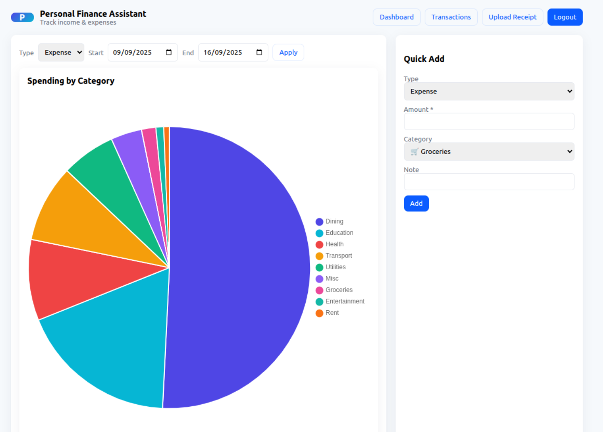
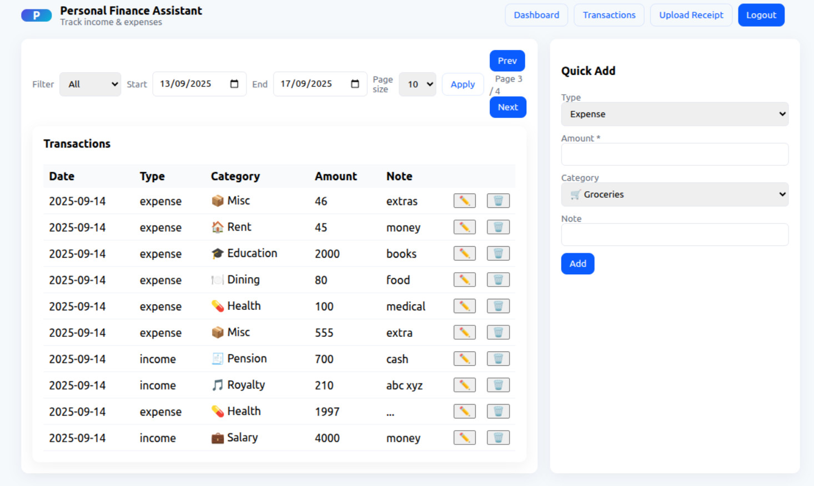
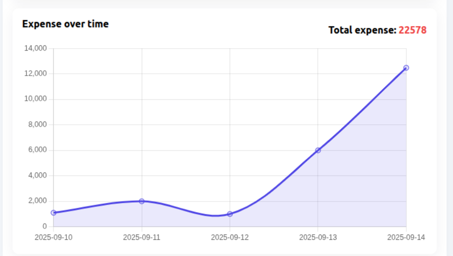
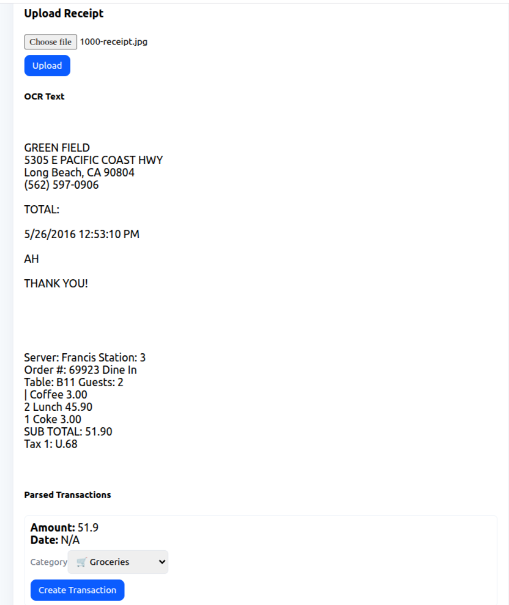

# Personal Finance Assistant

A **full-stack Personal Finance Assistant** project for managing income and expenses, visualizing insights, and automating data entry from receipts.

---

## 🚀 Tech Stack

### Frontend
* ⚛️ **React (Vite)**
* 🎨 **TailwindCSS / Chart.js (for charts)**
* 🔑 JWT authentication integration

### Backend
* ⚡ **FastAPI** (Python)
* 🗄️ **MongoDB** (local or Atlas)
* 🔐 JWT authentication
* 🧾 **OCR parsing** (Tesseract, pdf2image, Poppler)

### Others
* 🧰 **Tesseract OCR** and **Poppler** binaries for text extraction
* 📦 Node.js + npm (for frontend)
* 🐍 Python 3.11+ (for backend)

---

## 🛠️ System prerequisites

* Python 3.11+
* Node.js 18+ and npm
* MongoDB running locally or Atlas
* System binaries for OCR: `tesseract` and `poppler` (for pdf2image)

On Ubuntu/Debian:
```bash
sudo apt update
sudo apt install -y tesseract-ocr poppler-utils
````


## ⚙️ Backend setup

1. Create and activate venv:

```bash
python -m venv .venv
source .venv/bin/activate
```

2. Install requirements:

```bash
pip install -r backend/requirements.txt
```

3. Add `.env` in **backend/** and set:

```
MONGO_URI=mongodb://localhost:27017
DB_NAME=pfa_db
SECRET_KEY=replace_this_with_a_long_random_string
```

4. Run the backend:

```bash
cd backend
uvicorn app.main:app --reload --host 0.0.0.0 --port 8000
```

---

## 💻 Frontend setup

1. Install dependencies and run dev server:

```bash
cd frontend/
npm install
npm run dev
```

2. Open the URL shown by Vite (default: [http://localhost:5173](http://localhost:5173)).

---

## 🔑 Authentication (Create & Login)

1. **Register a new account**

   * Open the frontend app in your browser.
   * Go to **Register** page.
   * Enter username, email, and password → Submit.
   * Your account is created in MongoDB.

2. **Login**

   * Go to **Login** page.
   * Enter your credentials.
   * You’ll receive a **JWT token** which is stored in local storage and used for all authenticated API requests.

3. **Protected routes**

   * Once logged in, you can:

     * Add transactions
     * Upload receipts
     * View dashboard & charts
     * Filter transactions by date

---

## 📊 Variables & Categories

### Transaction Type

* **Income**
* **Expense**

### Default Categories

#### Income

```json
[
  "Salary",
  "Investment",
  "Rental",
  "Royalty",
  "Pension",
  "Other Income"
]
```

#### Expense

```json
[
  "Groceries",
  "Transport",
  "Dining",
  "Rent",
  "Utilities",
  "Entertainment",
  "Health",
  "Education",
  "Misc"
]
```

---

## 📈 Features

### Transactions

* ➕ Create, ✏️ edit, ❌ delete, and 👀 view transactions
* 📅 Filter transactions by **start date** and **end date**

### Dashboard & Analytics

* 📊 **Pie chart** of expenses by category
* 📊 **Pie chart** of incomes by category
* 📈 **Time series graph** of income
* 📈 **Time series graph** of expenses
* 💰 **Total income/expense summary**

### Receipt Upload

* Upload **PDF** or **image receipts**
* OCR extracts text, parses total amount, and automatically creates a transaction


```markdown
## 🖼️ Screenshots

  
  
  


```